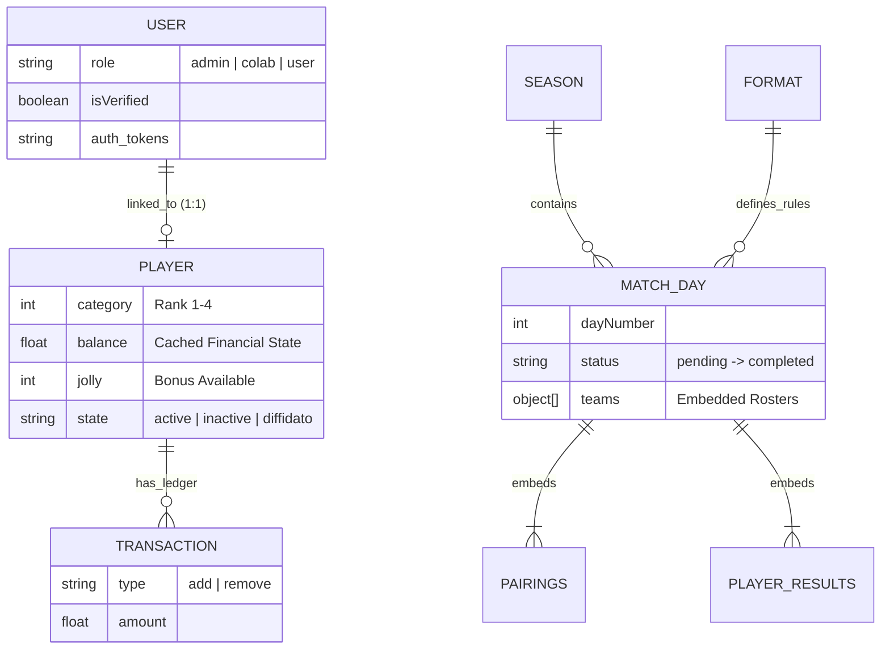

# 🏢 SingleGameApp — Tournament Management Platform

SingleGameApp is a full-featured application designed to manage an individual-based amateur football league.  
It replaces the entire operational workflow previously handled with spreadsheets and manual communication.

The project is based on a **real-world use case** and will be used in production by **SingleGame**, an organization active for over 25 years with more than 100 registered players.

---

## ⚠️ Context & Problem

With the growth of participants and the upcoming transition to a formal *Sports Association*, the spreadsheet-based workflow became unsustainable.

**Key issues identified:**

1. **Manual ranking management** → high risk of human error.  
2. **No data access for players** → stats, history, and rankings not available in real time.  
3. **Lack of scalability** → unable to support multiple seasons, parallel competitions, or disciplinary/financial workflows.

SingleGameApp addresses these issues with a modern, secure, and scalable infrastructure.

---

# 🧩 Core Features

The system includes a Role-Based Access Control (RBAC) model with three clearly separated user types: **Admin**, **Media Collaborators**, and **Players**.

---

## 👑 Admin Module — League Management

Full operational control over the tournament ecosystem.

- **Player registry** with full performance history.  
- **Season management**: create new seasons and parallel cups/tournaments.  
- **Automated Scoring Engine** — match results trigger an automatic ranking update based on a proprietary algorithm.  
- **Match creation & availability check** for players.  
- **Disciplinary system**: penalties, suspensions, bonus “Jolly”.  
- **Financial module**: payments, charges, seasonal balance tracking.

---

## 📰 Colab Module — Media & Content

For the communication and media team.

- Dedicated editor for publishing the weekly *SingleGame Journal*.  
- Article and post-match content management.  
- *(In development)* Media repository for photos and video interviews.

---

## ⚽ User Module — Player Dashboard

For all registered players.

- **Live leaderboards** with historical filters.  
- **Pre-match Jolly activation**, automatically locked at kickoff.  
- **Personal profile**: stats overview, match history, payment status.

---
### 💾 Data Model & Relationships

The database schema is designed using a **hybrid approach** (Embedding + Referencing) to balance read performance with data consistency.

Key entities relationship diagram:


## 🗄️ Database Strategy & Patterns

### 1. Decoupled Identity Pattern (`User` vs `Player`)
I strictly separate **Authentication** from **Domain Logic**:
* **`User` Model:** Handles credentials, roles (RBAC), and security tokens (reset password, verification).
* **`Player` Model:** Handles game-related data (ranking category, financial balance, stats).
* **Benefit:** This allows non-playing admins to exist without cluttering the player rankings, and allows players to retain their history even if they change login methods.

### 2. Hybrid Schema (The `MatchDay` Document)
The `MatchDay` model is the core operational document. Instead of normalizing every single goal or match into separate collections, I use **Embedding**:
* **Performance:** Fetching a Match Day returns the full context (Rosters, Pairings, Scores, and Individual Results) in a **single query**.
* **Snapshotting:** `playerResult` array inside `MatchDay` acts as a frozen snapshot of the performance for that specific date, immune to future changes in the Player's profile.

### 3. Financial Ledger Pattern (`Transaction`)
Financial data is critical. Instead of simply updating `Player.balance`:
* Every monetary change is recorded as an immutable `Transaction` document (`add`/`remove`).
* The `Player.balance` field acts as a **Cached Value** for quick read access, but the source of truth remains the transaction history.

### 4. Finite State Machine
The Tournament lifecycle is managed via strict status transitions within the `MatchDay` model:
`pending` → `pairing-pending` → `ready` → `confirmed` → `completed`.
This prevents invalid operations (e.g., playing "Jolly" on a closed match).


### 🧮 Automated Scoring Engine

The scoring logic is dynamic and configurable via the **`Format`** model (defining max teams/players).

**The Calculation Pipeline:**
1.  **Ingestion:** Admin inputs raw scores into the `MatchDay.pairings` embedded array.
2.  **Evaluation:** The engine iterates through pairings, applying rules for "Clear Win", "Narrow Win", or "Golden Goal".
3.  **Individual Processing:**
    * Calculates points for every player involved based on the `Format` rules.
    * Checks `jollyPlayedBy` array: if a player used a bonus, the multiplier is applied.
    * Generates `playerResult` objects embedded in the document.
4.  **Atomic Commit:** Updates `Player` stats and `Season` rankings in a transactional operation to ensure leaderboard integrity.

# 📁 Monorepo Structure
```
packages/
├── client → React (Frontend)
├── server → Node/Express REST API
└── shared → Shared Zod schemas
```


The shared library provides **End-to-End Type Safety** between client and server.

---

# 💻 Tech Stack

| Area | Technology | Notes |
|------|------------|--------|
| Frontend | React 19 | Actions, useOptimistic |
| Build | Vite 7 | Fast HMR & bundling |
| Routing | React Router 7 | Modern routing |
| UI | TailwindCSS + DaisyUI | Modular design system |
| State | Zustand | Lightweight global store |
| Forms | React Hook Form + Zod | Strong client validation |
| Backend | Node.js + Express 5 | Modular API design |
| Database | MongoDB + Mongoose 8 | Schema-based ODM |
| Media | Cloudinary | Optimized image/video delivery |
| Email | Resend | Transactional email |
| Security | JWT, BCrypt, Helmet | Stateless authentication |

---

# 🛠️ Technical Architecture

- **Layered architecture**: Router → Controller → Service → Model  
- **Centralized validation** using Zod  
- **Dedicated error-handling middleware**  
- **Structured logging** (info/error levels)  
- **Advanced filtering & search** via Mongoose  
- **WebSocket-ready** for future real-time features  

---

# 🛠️ Local Development Setup

### Requirements
- Node.js 20+  
- npm
- MongoDB (local or Atlas cluster)

### Install dependencies
```bash
npm install
```
# ☁️ Deployment Architecture
Component	Provider	Reason
Frontend	Vercel	Optimized for React + Edge CDN
Backend	Render	Persistent Node processes (cron, WebSocket)
Database	MongoDB Atlas	Backups, scaling, monitoring
Media	Cloudinary	Asset management + CDN

# 🔄 CI/CD Strategy

Frontend: Vercel builds and deploys on every main push.

Backend: Render rebuilds and deploys automatically on main.

Secure environment variables for DB, JWT, Cloudinary, etc.

# 🔗 Production Links

Live App: coming soon

API Endpoint: coming soon


## 📞 Contact & Support

This project was developed and is currently maintained by:

* **Developer:** Francesco Andaloro
* **GitHub:** [@Frandalor](https://github.com/Frandalor)
* **LinkedIn:** [View Profile](https://www.linkedin.com/in/francesco-andaloro-3819a01b9/)

---

### © Copyright
**SingleGameApp** is a proprietary software developed for the SingleGame organization.
Unauthorized copying, modification, distribution, or use of this software is strictly prohibited without express permission.

© 2025 SingleGame. All rights reserved.


